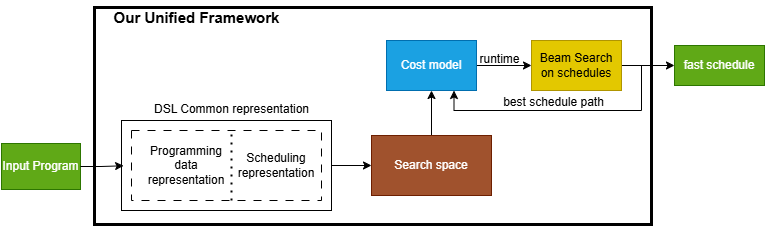

# Optimizing_Tensor_Programs

Domain-specific languages (DSLs) like Halide and Tiramisu facilitate optimized tensor computations, leveraging cost models to select optimal program schedules. However, disparate program representations and cost modeling methodologies hinder accurate cross-system performance prediction across these DSLs. The absence of a unified approach necessitates continuous adaptation and leads to inefficiencies. This work proposes a unified performance prediction framework for tensor programs across these DSLs by developing a common cost model. Our approach involves establishing a common representation for program schedules by analyzing and integrating commonalities in code transformations and scheduling techniques and constructing a robust, adaptable machine learning model architecture for performance prediction. Then this model uses an auto-tuner to select the best program schedule based on the performance prediction results. This adaptive framework promises to significantly improve the optimization process and provide resilience against evolving challenges in DSL performance prediction.

## Project Architecture

## Report Details

Read **Chapters 3 & 4** for methodology and results in the [Mid Review Report](Mid_Review_Report.pdf).

